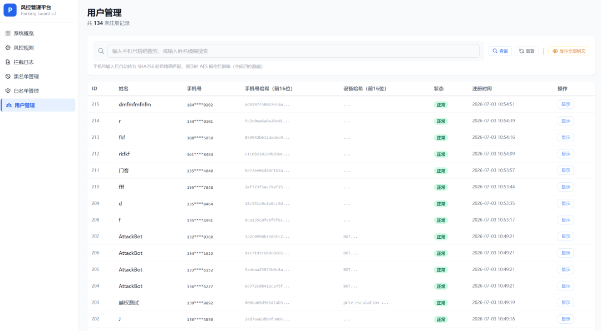
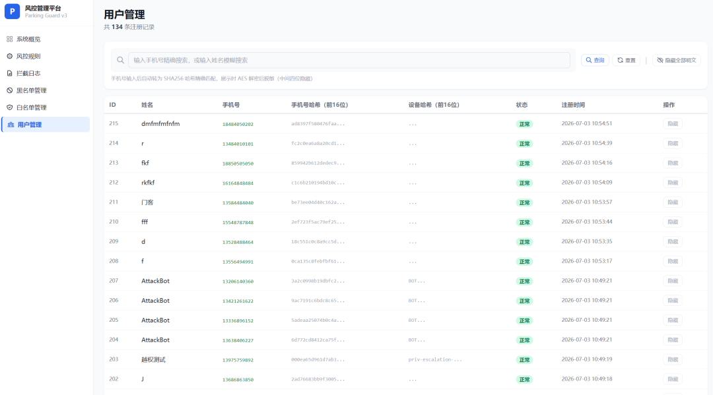

# Parking Guard -- 智能停车风控反欺诈系统

> 全栈风控平台，防羊毛党刷取停车场新人优惠券

   

---

## 这个系统是做什么的？

商场停车场搞推广活动 -- **新用户注册就送一张免费停车券**。

结果来了羊毛党：他们用脚本批量注册假账号，领取停车券，注销后再注册……无限循环薅羊毛。

这个系统做三件事：**识别作弊行为、自动拦截、同时让正常用户不受影响**。

就像停车场门口的一个智能保安：好人直接进，可疑的人做个拼图验证（证明你是人不是机器），确定是坏人的直接拦住。

---

## 系统怎么防？

四道防线，层层过滤每一次注册请求：

```
用户点击「注册领券」
      |
      v
[第一道：IP 频控]
同一网络地址 60 秒内注册超过 5 次
--> 弹出滑块拼图验证码（40101）
      | 通过
      v
[第二道：设备黑名单]
注销时生成不可逆设备指纹，拉入 90 天黑名单
--> 同一部手机换号也无法重新注册（40301）
      | 通过
      v
[第三道：手机号注销库]
注销时手机号 SHA256 哈希沉淀到注销库
--> 同一手机号换设备也无法绕过（40300）
      | 通过
      v
[第四道：验证码失败锁定]
10 分钟内验证码连续失败 3 次
--> IP 自动封禁 24 小时（40302）
      | 通过
      v
  注册成功，发放停车券
```

| 场景 | 触发条件 | 系统反应 | 错误码 |
|:---|:---|:---|:---|
| 正常注册 | 无异常 | 直接通过，发券 | 20000 |
| 同 IP 注册太频繁 | 60s 内 5+ 次 | 弹出滑块验证码 | 40101 |
| 验证码连续失败 | 10min 内 3+ 次 | IP 封禁 24 小时 | 40302 |
| 注销过的设备重注册 | 设备在 90 天黑名单 | 直接拒绝 | 40301 |
| 注销过的手机号重注册 | 手机号在注销库 | 直接拒绝 | 40300 |
| 疯狂点注销 | 10min 内 4+ 次 | 熔断拒绝 (429) | 42900 |
| 白名单用户 | 管理员手动添加 | 免检全部风控 | -- |

---

## 系统整体结构

| 层 | 技术 | 职责 |
|:---|:---|:---|
| 手机 App | React Native + Expo | 注册领券 / 滑块验证 / 注销账号 / 风控拦截提示 |
| 后端服务 | Node.js + Express | 四层中间件链 + RiskService / CaptchaService / AuthService |
| 缓存 | Redis 7 | 限流计数器 / 黑名单高速命中 / TTL 自动过期 |
| 数据库 | MySQL 8.0 | 11 张风控表 (InnoDB) / 手机号 AES-256 加密 / SHA256 哈希索引 |
| 测试 | 240 用例 | 红队渗透 + 蓝队验收 + Jest 单元测试 |
| 部署 | Docker Compose | 3 个容器（backend / redis / mysql）一键启动 |

---

## 系统截图

### C 端（手机 App）

| 注册页面 | 注册成功 | 已有优惠券 |
|:---:|:---:|:---:|
|  |  |  |

| 注销确认 | 风控拦截 | 滑块验证 |
|:---:|:---:|:---:|
|  |  |  |

### B 端（管理后台）

**安全登录** -- Argon2id 密码校验 + RS256 JWT


**风控监控大盘** -- 实时拦截趋势、用户统计、黑名单数


**拦截日志** -- 每条拦截的 IP、设备哈希、原因、风险等级


**黑名单管理** -- 支持手机号搜索、手动添加、解封


**白名单管理** -- 免检 VIP 通道


**规则配置** -- 在线调整限流阈值、黑名单天数


**用户管理（脱敏）** -- 手机号 AES 解密后脱敏显示，操作列「显示」按钮



**用户管理（明文）** -- 点击后显示绿色完整明文，按钮切换为「隐藏」



### 基础设施

**Docker 容器** -- 三个服务（backend / redis / mysql）全部运行中


**Redis 黑名单 Key** -- 缓存中的风控黑名单


**MySQL 用户表（密文）** -- `phone` 列为 AES-256-CBC 密文，非明文


**MySQL 拦截日志** -- 拦截原因、风险等级、时间戳


---

## 数据安全

### 手机号：双层存储

停车用户注册时，手机号产生两份数据，各司其职：

```
13812345678
   |
   +--> sys_users.phone (AES-256-CBC 加密)
   |    格式: iv:cipher
   |    可逆: 是，需 ENCRYPT_KEY 解密
   |    用途: 管理员后台查看用户详情
   |
   +--> sys_users.phone_hash (SHA256 加盐哈希)
        格式: 64 位 hex
        可逆: 否，单向不可逆
        用途: 注册时查重、注销后黑名单匹配
```

**为什么两份？**

注销后的手机号被加入黑名单（`pf:risk:hash_bl:{phoneHash}`），下次注册时系统需要快速判断「这个号在黑名单里吗」。用 SHA256 哈希比对，比逐条 AES 解密快几个数量级，且不触碰解密密钥 -- 遵循最小化敏感信息暴露原则。密钥存在 `.env` 的 `ENCRYPT_KEY` 中，不进入代码仓库。

### 管理员后台：手机号展示与审计

管理员打开用户管理页面，所有手机号默认脱敏（`138****5678`）。只有点击「显示」按钮或「显示全部明文」时，后端才调用 AES 解密接口返回明文，操作同步写入 `sys_audit_logs`。明文显示后可一键切回脱敏。整个流程确保明文不会默认暴露在任何页面或日志中。

### 管理员密码：Argon2id

管理后台的登录密码用 Argon2id 保存。参数 `memoryCost=16MB, timeCost=2`：正常登录 50-100ms 无感，但如果攻击者拿到数据库后尝试 GPU 暴力破解，每秒只能试十几次。

### 登录凭证：RS256 JWT

管理员登录后，后端签发 RS256 JWT 存入 HttpOnly Cookie。后台所有操作（查看黑名单、调整规则、解密手机号）都经过 JWT 校验。

选择 RS256 是因为：
- 私钥仅后端持有，即使 `.env` 泄露公钥也无法伪造 token
- `algorithms: ['RS256']` 显式限制，防止攻击者发 `alg: none` 绕过签名

Cookie 加固：`httpOnly` 防 XSS 窃取，`sameSite: strict` 防 CSRF，JTI 写入 Redis 吊销黑名单支持主动踢出。

---

## 技术选型

### Node.js + Express（后端）

本项目核心是一条四层风控中间件链，每次注册请求依次经过 IP 黑名单、注册频控、全局防刷、手机号限流，任一命中即拦截。Express 的洋葱圈模型天然适合这种「层层过滤」的架构：

```javascript
router.post('/register',
  ipBlacklist,      // 第一层：IP 是否在 24h 封禁中
  regIpLimiter,     // 第二层：60s 内同 IP 超 5 次触发验证码
  globalIpLimiter,  // 第三层：全局 10 次/秒兜底
  phoneLimiter,     // 第四层：单手机号 5 秒内仅允许 1 次
  userController.register
);
```

风控系统是 IO 密集型 -- 每次注册要读写 Redis（查黑名单、计数）和 MySQL（入库）。Node.js 的非阻塞 IO 在大量并发注册时不会因等待网络而阻塞后续请求，与 Go/Java 的多线程模型相比，在这种场景下代码量和心智负担更小。

### MySQL 8.0（持久化）

本系统 11 张表全部围绕停车反欺诈业务：`sys_users` 存注册用户，`sys_blacklist` + `risk_hash_archives` + `phone_blacklist_map` 三层黑名单沉淀，`risk_intercept_logs` 记录每次拦截，`sys_audit_logs` 追踪管理员操作。

一个关键的场景是注销：用户注销后，系统需要同时删除用户记录、写入设备黑名单、写入手机号哈希归档、写入映射表、同步 Redis。MySQL 的 `BEGIN/COMMIT` 事务保证这 5 步要么全做要么全不做，避免出现「用户已删但黑名单没写」的半成品状态。

参数化查询（`pool.query(sql, [phoneHash])`）防范 SQL 注入，红队测试中 4 项 SQL 注入攻击全部被拦截。

### Redis 7（缓存与限流）

Redis 在本系统中承担两个核心角色：

**限流计数**：`pf:limit:reg_ip:{ip}` 是注册频控的计数器。`INCR` 命令单线程原子执行 -- 两个并发请求同时到达时，不会出现「都读到 3，都认为自己是第 4 次」的竞态。第一个请求设 60 秒 TTL，窗口结束自动归零。

**黑名单高速命中**：设备黑名单以 `pf:risk:device_bl:{deviceId}` 存储，手机号注销库以 `pf:risk:hash_bl:{phoneHash}` 存储，TTL 均为 90 天。注册时亚毫秒级命中直接返回 403，无需查询 MySQL。

Redis 不可用时，限流切内存 Map + setTimeout，黑名单切内存 Set，验证码答案切内存缓存 -- 系统不会因缓存故障而拒绝服务。

### React Native + Expo（移动端）

C 端用户通过 App 完成注册、滑块验证、领券、注销的完整闭环。React Native 一套代码同时覆盖停车场用户的 iOS 和 Android 设备，Expo 屏蔽了 Xcode/Android Studio 的原生配置，开发聚焦在业务链路：注册表单校验、滑块拼图交互、风控拦截提示（40301/40300/40302 错误码对应的 UI 反馈）。

### Docker Compose（部署）

三个容器（backend / redis / mysql）通过 `docker-compose.yml` 编排。MySQL 配置了 `healthcheck`（每 10 秒 `mysqladmin ping`），backend 的 `depends_on` 等待 MySQL healthy 后才启动，避免后端启动时连不上数据库报错。

命名卷 `redis_data` 和 `mysql_data` 保证容器重启后拦截日志和黑名单数据不丢失。`/health/ready` 就绪探针用原生 TCP 直连检测 MySQL + Redis，3 秒超时，从宕机恢复时自动预热连接池。

---

## 自动化测试

测试报告自动生成于 `tests/reports/`。

### 红队渗透测试：26 用例，100% 通过，评级 A+

| 模块 | 攻击项 | 防线守住 | 评级 |
|:---|:---|:---|:---|
| 风控核心渗透 | 16 | 16 | A+ |
| 数据层安全（SQL 注入 / 密钥绕过） | 4 | 4 | A+ |
| 管理后台攻防（JWT 伪造 / 越权） | 6 | 6 | A+ |

- 恶意重刷压测：**13,696 次请求，1,369 QPS，平均延迟 6.8ms**
- JWT 伪造攻击：**2 次非法伪造全部拦截，0 次越权**
- 黑名单膨胀注入：**100 条，97 条被限流拦截（97%）**

### 蓝队功能验收：182 用例，100% 通过

| 模块 | 用例 | 通过 | 备注 |
|:---|:---|:---|:---|
| 风控核心（三级分级 / IP 封禁 / 滑块 / 白名单） | 69 | 69 | 耗时 241s |
| 数据层（表结构 / 读写一致 / 并发 / 事务 / 加密） | 8 | 8 | -- |
| 管理员后台（登录 / 限流 / 黑名单 CRUD / 概览） | 10 | 10 | -- |
| 工程化改造（统一格式 / JWT 鉴权 / 权限拦截） | 10 | 10 | -- |
| App 配置校验（app.json / eas.json / 资源 / 依赖） | 29 | 29 | -- |
| 健康探针（存活 / 就绪 / MySQL 降级 / Redis 降级） | 44 | 44 | 耗时 53s |
| 优雅关闭（SIGTERM / SIGKILL / 资源释放） | 12 | 12 | 耗时 25s |

### Jest 单元测试：32 用例，100% 通过

- `risk.service.test.js`：18 用例全部通过
- `encryption.test.js`：14 用例全部通过

```bash
cd tests && npm install && node index.js    # 一键运行全部测试
```

---

## 快速启动

### 1. 克隆并配置

```bash
git clone https://github.com/20060101zrd-gif/Smart_Parking_Anti_Fraud_System_V3.git
cd Smart_Parking_Anti_Fraud_System_V3
cp .env.example .env       # 编辑 .env 中的密码
```

### 2. 一键启动

```bash
docker-compose up -d --build

# 风控管理后台:  http://localhost:3000/index.html
# 用户管理页面:  http://localhost:3000/users.html
```

### 3. 一键解密手机号（命令行工具）

```bash
cd backend
node decrypt.js              # 脱敏模式（138****5678），截图安全
node decrypt.js --full       # 完整手机号
node decrypt.js --limit=10   # 只看最近 10 条
node decrypt.js --help       # 帮助
```

### 4. 运行测试

```bash
cd tests && npm install
node index.js
```

---

## API 接口清单

### C 端（用户）

| 方法 | 路径 | 说明 |
|:---|:---|:---|
| `POST` | `/api/v1/user/register` | 注册领券，经过四层中间件链 |
| `POST` | `/api/v1/user/verify-captcha` | 滑块验证 + 注册 |
| `POST` | `/api/v1/user/cancel` | 注销账号，触发 90 天黑名单 |
| `GET` | `/api/v1/captcha/generate` | 获取滑块验证码 |
| `POST` | `/api/v1/captcha/verify` | 提交滑块位置，答案一次性核销 |

### B 端（管理员）

| 方法 | 路径 | 说明 |
|:---|:---|:---|
| `POST` | `/api/v1/admin/login` | 登录，返回 JWT Cookie |
| `GET` | `/api/v1/admin/overview` | 风控大盘数据 |
| `GET` | `/api/v1/admin/intercept-logs` | 拦截日志，支持 IP/日期筛选 |
| `PUT` | `/api/v1/admin/config` | 动态调整风控规则 |
| `GET` | `/api/v1/admin/blacklist` | 黑名单，双源合并 + 手机号搜索 |
| `POST` | `/api/v1/admin/blacklist/add` | 手动添加黑名单 |
| `POST` | `/api/v1/admin/blacklist/remove` | 移除黑名单 |
| `POST` | `/api/v1/admin/blacklist/unban-phone` | 按手机号解封 |
| `GET` | `/api/v1/admin/whitelist` | 白名单列表 |
| `POST` | `/api/v1/admin/whitelist/add` | 添加白名单 |
| `POST` | `/api/v1/admin/whitelist/remove` | 移除白名单 |
| `GET` | `/api/v1/admin/users` | 用户列表，脱敏 + 分页 + 搜索 |
| `GET` | `/api/v1/admin/users/phone/:id` | 单用户手机号解密 |
| `POST` | `/api/v1/admin/users/decrypt-phones` | 批量解密，最多 100 条 |
| `GET` | `/api/v1/health` | 存活探针 |
| `GET` | `/api/v1/health/ready` | 就绪探针 |

> 解密接口均有审计日志记录。

---

## 项目结构

```text
parking-fraud-system/
+-- backend/
|   +-- src/
|   |   +-- controllers/    # 用户 & 管理员控制器
|   |   +-- services/       # 风控 / 审计 / 验证码 / 白名单
|   |   +-- middlewares/    # 限流 / JWT / 验证码Token / 黑名单
|   |   +-- data/           # Redis 客户端 / MySQL 连接池
|   |   +-- routes/         # API 路由 (v1)
|   |   +-- utils/          # 加密 / 日志 / 响应
|   +-- public/             # 管理后台（风控大盘 + 用户管理 SPA）
|   +-- sql/                # MySQL 初始化脚本
|   +-- decrypt.js          # 命令行工具：一键解密用户手机号
|   +-- Dockerfile
+-- mobile/
|   +-- src/
|   |   +-- screens/        # 注册 / 领券 / 注销
|   |   +-- components/     # 滑块验证码
|   +-- App.js
+-- tests/
|   +-- red-team/           # 6 个渗透攻击模块
|   +-- blue-team/          # 7 个功能验收模块
|   +-- unit/               # Jest 单元测试
|   +-- reports/            # 自动生成测试报告
|   +-- index.js            # 一键运行全部测试
+-- screenshots/
+-- docker-compose.yml
+-- redis.conf
+-- README.md
```

---

## CI/CD

**GitHub Actions** -- push/PR 触发全量自动化测试：`npm ci` --> Jest --> Docker Compose 启动 --> 红队 + 蓝队

**Codemagic** -- main 分支 push 触发 iOS unsigned IPA 构建

---

## 已知局限

- **分布式扩展**：当前单节点部署。多节点集群可基于已有 Redis 加 Redlock 分布式锁，解决跨节点计数器一致性。
- **风控维度**：当前以手机号哈希 + IP 为主，可扩展接入设备硬件物理指纹（传感器特征、屏幕参数等）。
- **日志监控**：当前拦截日志存 MySQL，可接入 ELK / Grafana 实现实时告警与可视化。

---

## 开源协议

MIT License -- 详见 [LICENSE](LICENSE)
