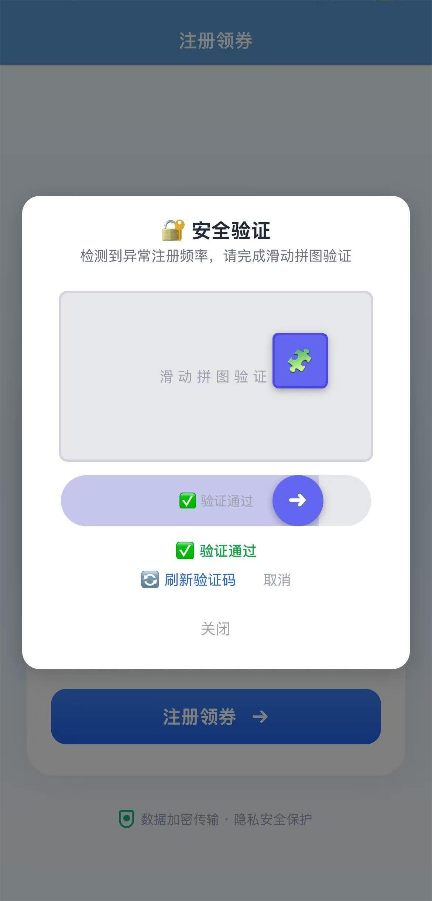

# 智能停车风控反欺诈系统

> Smart Parking Anti-Fraud System — 全栈风控平台，覆盖 C 端领券 + B 端管控 + 红蓝对抗测试

      

---

## 一、测试结果全景

| 测试套件 | 用例数 | 通过率 | 评级 |
|----------|--------|--------|------|
| 🔴 Red Team 渗透攻击 | 26 | **100%** | 🟢 A+ (卓越) |
| 🔵 Blue Team 功能验收 | 182 | **100%** | ✅ 全部通过 |
| 🧪 Jest 单元测试 | 32 | **100%** | ✅ 全部通过 |
| **合计** | **240** | **100%** | — |

<details>
<summary>📊 红队渗透测试详情</summary>

| 模块 | 攻击项 | 防线守住 | 通过率 | 评级 |
|------|--------|----------|--------|------|
| 风控核心渗透 | 16 | 16 | 100% | A+ |
| 数据层安全 (SQL注入/密钥绕过) | 4 | 4 | 100% | A+ |
| 管理后台攻防 (JWT/越权) | 6 | 6 | 100% | A+ |
| 恶意重刷压测 | 13,696 次 | 1,369 QPS / 6.8ms | ✅ | — |
| JWT 伪造攻击 | 2 | 全部拦截 | ✅ | — |
| 黑名单膨胀注入 | 100 | 97 被限流 (97%) | ✅ | — |

</details>

<details>
<summary>📊 蓝队功能验收详情</summary>

| 模块 | 用例数 | 通过 | 通过率 |
|------|--------|------|--------|
| 风控核心 (三级分级/IP黑名单/滑块/白名单) | 69 | 69 | 100% |
| 数据层 (表结构/读写一致/并发/事务/加密) | 8 | 8 | 100% |
| 管理员后台 (登录/限流/黑名单CRUD/概览) | 10 | 10 | 100% |
| 工程化改造 (统一格式/JWT鉴权/权限拦截) | 10 | 10 | 100% |
| App 配置校验 (app.json/eas.json/资源/依赖) | 29 | 29 | 100% |
| 健康探针端点 (存活/就绪/MySQL降级/Redis降级) | 44 | 44 | 100% |
| 优雅关闭验证 (SIGTERM/SIGKILL/资源释放) | 12 | 12 | 100% |

</details>

<details>
<summary>🧪 单元测试详情</summary>

| 套件 | 用例 | 通过 |
|------|------|------|
| `risk.service.test.js` | 18 | ✅ |
| `encryption.test.js` | 14 | ✅ |

</details>

---

## 二、系统截图

### C 端用户链路 (Expo / React Native)

| 注册领券 | 注册成功 | 已有账户 | 账号注销 | 风控拦截 |
|:---:|:---:|:---:|:---:|:---:|
|  |  |  |  |  |

| 滑块验证 | 验证通过 |
|:---:|:---:|
|  |  |

### B 端管理后台

| 登录页 | 风控大盘 | 拦截日志 | 黑名单管理 | 白名单管理 | 风控规则配置 |
|:---:|:---:|:---:|:---:|:---:|:---:|
|  |  |  |  |  |  |

### 基础设施

| Docker 容器 | Redis 风控黑名单 | MySQL sys_users | MySQL risk_intercept_logs |
|:---:|:---:|:---:|:---:|
|  |  |  |  |

---

## 三、核心风控能力

### 三级风险分级

```
LOW (正常)    → 直接注册，发放停车券
MEDIUM (频控) → 触发滑块人机验证 (40101)
HIGH (黑名单) → 直接拒绝 (40300/40301/40302)
```

- **设备指纹黑名单**：注销后 90 天冷冻，同一设备无法重新注册 (40301)
- **IP 临时黑名单**：连续 3 次验证失败 → 自动封禁 24h (40302)
- **手机号注销库**：SHA256 加盐哈希沉淀，换设备也无法绕过 (40300)
- **IP 注册频控**：60s 内 ≥5 次 → 中风险人机验证
- **注销频控**：10min 内 >4 次 → 429 熔断

### 数据安全

- 手机号 AES-256-CBC 加密存储 (密文格式 `iv:cipher`)
- 设备指纹 Argon2id 不可逆哈希
- JWT RS256 非对称签名 (防伪造/篡改)
- SQL 注入全量拦截
- Redis 内存降级 (宕机时不崩溃)

---

## 四、技术栈

| 层 | 技术 |
|----|------|
| 移动端 | Expo SDK 54, React Native |
| 后端 | Node.js 18, Express.js |
| 数据库 | MySQL 8.0 (InnoDB, utf8mb4) |
| 缓存 | Redis 7 (Alpine, RDB 持久化) |
| 安全 | Argon2id, JWT RS256, AES-256-CBC |
| 测试 | Jest, Autocannon (压测), 红蓝对抗套件 |
| 运维 | Docker Compose, 健康探针, 优雅关闭 |
| CI/CD | Codemagic (iOS unsigned IPA) |

---

## 五、项目结构

```text
parking-fraud-system/
├── backend/
│   ├── src/
│   │   ├── controllers/    # 用户 & 管理员控制器
│   │   ├── services/       # 风控 / 审计 / 验证码 / 白名单
│   │   ├── middlewares/    # 限流 / JWT / 验证码Token / 黑名单
│   │   ├── data/           # Redis 客户端 / MySQL 连接池
│   │   ├── routes/         # API 路由 (v1)
│   │   └── utils/          # 加密 / 日志 / 响应
│   ├── public/             # 管理后台静态页面
│   ├── Dockerfile
│   └── jest.config.js
├── mobile/
│   ├── src/
│   │   ├── screens/        # 注册 / 领券 / 注销
│   │   └── components/     # 滑块验证码
│   └── App.js
├── tests/
│   ├── red-team/           # 🔴 6 个渗透攻击模块 + run.js
│   ├── blue-team/          # 🔵 7 个功能验收模块 + run.js
│   ├── unit/               # 🧪 Jest 单元测试 + run.js
│   ├── reports/            # 自动生成的 .md / .txt 战报
│   └── index.js            # 一键运行全部测试
├── screenshots/
├── docker-compose.yml
├── redis.conf
└── README.md
```

---

## 六、快速启动

### 前置要求

- Docker & Docker Compose
- Node.js 18+
- 或：本地 MySQL 8.0 + Redis 7

### 1. 克隆 & 配置

```bash
git clone <repo-url>
cd parking-fraud-system
cp .env.example .env       # 编辑 .env 中的密码
```

### 2. 一键启动 (Docker)

```bash
docker-compose up -d --build
# 管理后台: http://localhost:3000
# 管理后台单页: http://localhost:3000/index.html
```

### 3. 裸机开发

```powershell
# PowerShell: 覆盖 Docker 容器名 → 127.0.0.1
$env:REDIS_HOST="127.0.0.1"; $env:MYSQL_HOST="127.0.0.1"; $env:MYSQL_PORT="3307"
cd backend && npm install && node src/index.js
```

### 4. 运行测试

```bash
cd tests
npm install
node index.js                 # 一键：红队 + 蓝队
node red-team/run.js          # 仅红队渗透
node blue-team/run.js         # 仅蓝队验收
node unit/run.js              # 仅 Jest 单元测试
```

测试报告自动输出到 `tests/reports/`。

---

## 七、API 清单

| 方法 | 路径 | 说明 |
|------|------|------|
| `POST` | `/api/v1/user/register` | C 端注册领券 (三级风险分级) |
| `POST` | `/api/v1/user/cancel` | C 端注销 (PII 擦除 + 90 天冷冻) |
| `POST` | `/api/v1/user/verify-captcha` | C 端滑块验证 + 注册 |
| `GET` | `/api/v1/captcha/generate` | 获取滑块验证码 |
| `POST` | `/api/v1/captcha/verify` | 提交滑块位置 |
| `POST` | `/api/v1/admin/login` | B 端登录 (RS256 JWT) |
| `GET` | `/api/v1/admin/overview` | 风控大盘数据 |
| `GET` | `/api/v1/admin/intercept-logs` | 拦截日志分页 |
| `GET` | `/api/v1/admin/blacklist` | 黑名单分页 |
| `POST` | `/api/v1/admin/blacklist/add` | 添加黑名单 |
| `POST` | `/api/v1/admin/blacklist/remove` | 移除黑名单 |
| `GET` | `/api/v1/admin/whitelist` | 白名单查询 |
| `POST` | `/api/v1/admin/whitelist/add` | 添加白名单 |
| `PUT` | `/api/v1/admin/config` | 修改风控规则阈值 |
| `GET` | `/health` | 存活探针 |
| `GET` | `/health/ready` | 就绪探针 (MySQL+Redis 状态) |

---

## 八、CI/CD

本项目的 Codemagic CI (`codemagic.yaml`) 自动化构建 iOS unsigned IPA，并通过 GitHub 状态检查返回结果：

- **触发条件**: `main` 分支 push / PR
- **环境**: Node 20, Xcode 16
- **流程**: `npm install` → `expo prebuild` → `xcodebuild archive` → `.ipa`
- **产物**: `mobile/unsigned.ipa`
- **说明**: 已移除已废弃的全局 `expo-cli` 安装与依赖 `secrets.NOTIFY_EMAIL` 的邮件通知，避免 GitHub 触发时因环境未配置 secret 而失败。

> 当前 CI 仅构建移动端，不运行测试套件。如需 CI 中跑测试，需在 CI 环境中启动 Docker Compose (MySQL + Redis + Backend)。

---

## 九、方案边界

- **单节点部署**：当前为单节点容器化，分布式集群需引入 Redis 分布式锁
- **设备指纹**：当前以注销冷冻为主，未接入硬件级物理指纹采集
- **日志审计**：操作审计日志仅 MySQL 本地归档，未对接 ELK

---

## 十、开源协议

MIT License — 详见 [LICENSE](LICENSE)
