# Parking Guard -- 智能停车风控反欺诈系统

> 全栈风控平台，防羊毛党刷取停车场新人优惠券

**一句话：帮停车场自动识别和拦截羊毛党刷券行为，让每一张新人优惠券都发到真正有价值的用户手上，节省营销预算。**

   

---

## 这个系统是做什么的？

**30 秒看懂**：商场停车场送新人停车券拉新，结果被羊毛党用脚本批量注册假号、反复领券倒卖。这套系统能自动识别机器作弊、拦截恶意注册，实测拦截 97% 以上的刷券行为，单台服务器每秒可处理上千次注册请求，同时不影响真实用户正常领券。

**工作方式**：就像停车场门口的一个智能保安——好人直接进，可疑的人做个拼图验证（证明你是人不是机器），确定是坏人的直接拦住。

---

## 系统怎么防？

**通俗类比**（像机场登机安检，五道关卡层层过滤）：

> 第一道：同一个网络地址短时间内反复来注册？停下来，先做人机验证。
> 第二道：同一台设备注册太多账号？直接禁入，设备维度计数封堵。
> 第三道：之前注销过账号的手机设备？直接禁入，换手机号也没用。
> 第四道：之前注销过的手机号？直接禁入，换设备也没用。
> 第五道：故意乱试验证码？整个 IP 禁入（时长可在后台动态调整）。

**技术实现**：

五道防线，层层过滤每一次注册请求：

```
用户点击「注册领券」
      |
      v
[第一道：IP 频控]
同一网络地址 60 秒内注册超过 N 次（N 可在后台风控规则配置面板动态调整）
--> 弹出滑块拼图验证码（40101）
      | 通过
      v
[第二道：单设备注册上限]
同一设备注册的活跃账号数超过上限（上限可在后台动态调整，默认 3）
--> 直接拒绝，提示设备关联账号已满（40301）
      | 通过
      v
[第三道：设备黑名单]
注销时生成设备指纹哈希（SHA-256），拉入 90 天黑名单
--> 同一部手机换号也无法重新注册（40301）
      | 通过
      v
[第四道：手机号注销库]
注销时手机号生成 SHA256 哈希（独一无二、不可反向还原的匿名编号）沉淀到注销库
--> 同一手机号换设备也无法绕过（40300）
      | 通过
      v
[第五道：验证码失败锁定]
10 分钟内验证码连续失败 N 次（N 可在后台动态调整，默认 3）
--> IP 自动封禁，时长可动态配置（默认 1 分钟，便于测试；生产环境可调为 24 小时）（40302）
      | 通过
      v
  注册成功，发放停车券
```

| 场景 | 触发条件 | 系统反应 | 错误码 |
|:---|:---|:---|:---|
| 正常注册 | 无异常 | 直接通过，发券 | 20000 |
| 同 IP 注册太频繁 | 60s 内 N+ 次（N 可动态配置） | 弹出滑块验证码 | 40101 |
| 同设备注册太多号 | 设备下活跃账号 ≥ 上限（默认 3） | 直接拒绝 | 40301 |
| 同设备注销太多次 | 设备累计注销 ≥ 上限（默认 2） | 拒绝注销 | 40301 |
| 验证码连续失败 | 10min 内 N+ 次（N 可动态配置） | IP 封禁（时长可配） | 40302 |
| 注销过的设备重注册 | 设备在 90 天黑名单 | 直接拒绝 | 40301 |
| 注销过的手机号重注册 | 手机号在注销库 | 直接拒绝 | 40300 |
| 疯狂点注销 | 10min 内 20+ 次 | 熔断拒绝 (429) | 42900 |
| 白名单用户 | 管理员手动添加 | 免检全部风控 | -- |

---

## 项目亮点

| 亮点 | 说明 |
|:---|:---|
| 完整业务闭环 | 覆盖 C 端注册领券、滑块验证、账号注销 + B 端风控大盘、黑/白名单管理、用户管理全流程 |
| 数据安全保障 | 手机号不存明文（AES 加密 + SHA256 哈希双层存储），管理员解密操作全程留痕可追溯 |
| 高并发抗压 | 实测每秒处理 1,369 次注册请求，平均延迟 6.8ms，缓存 / 数据库宕机时服务自动降级不中断 |
| 全量自动化测试 | 240 个测试用例 100% 通过，包含红队渗透攻击（JWT 伪造 / SQL 注入 / Token 重放），安全评级 A+ |
| 开箱即用 | Docker Compose 一键部署，内置健康探针、优雅关闭、Redis 故障降级，拿到代码 3 分钟跑起来 |

---

## 系统整体结构

| 层 | 技术 | 职责 |
|:---|:---|:---|
| 手机 App | React Native + Expo | 注册领券 / 滑块验证 / 注销账号 / 风控拦截提示 |
| 后端服务 | Node.js + Express | 四层中间件链 + RiskService / CaptchaService / AuthService |
| 双存储 | MySQL 8.0 + Redis 7 | MySQL 持久化 11 张风控表 + AES 加密 / Redis 高速限流 + 黑名单命中 |
| 测试 | 240 用例 | 红队渗透 + 蓝队验收 + Jest 单元测试 |
| 部署 | Docker Compose | 3 个容器（backend / redis / mysql）一键启动 |

---

## 系统截图

### C 端（手机）

| 注册页面 | 注册成功 | 已有优惠券 |
|:---:|:---:|:---:|
| 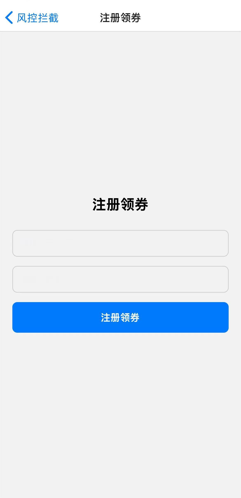 | 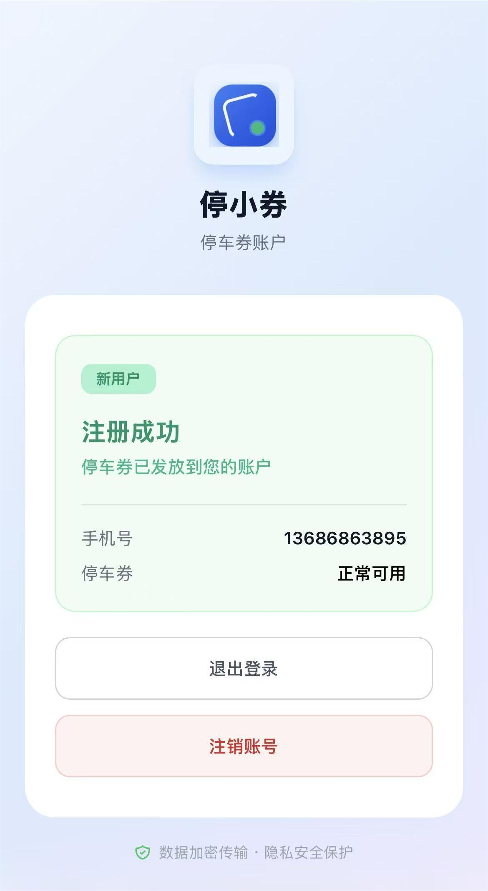 | 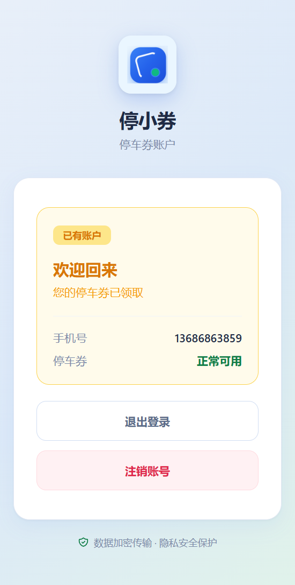 |

| 滑块验证 (IP频控) | 风控拦截 (验证失败) | 注销确认 |
|:---:|:---:|:---:|
| 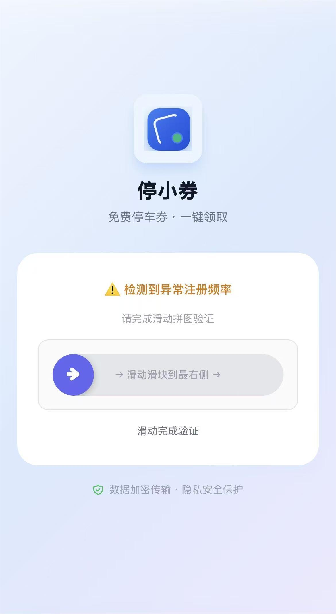 | 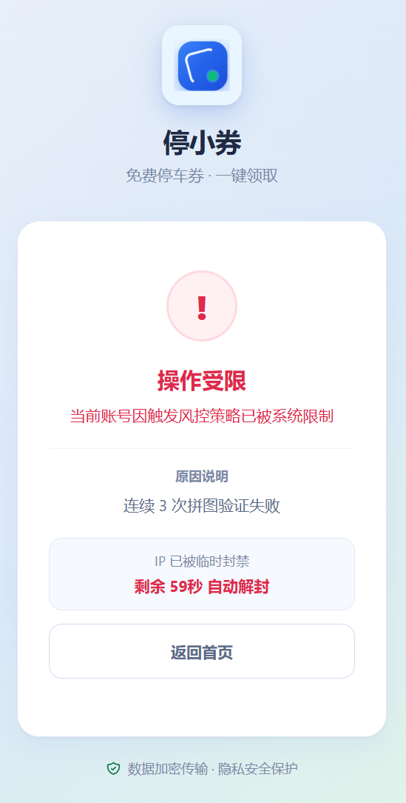 | 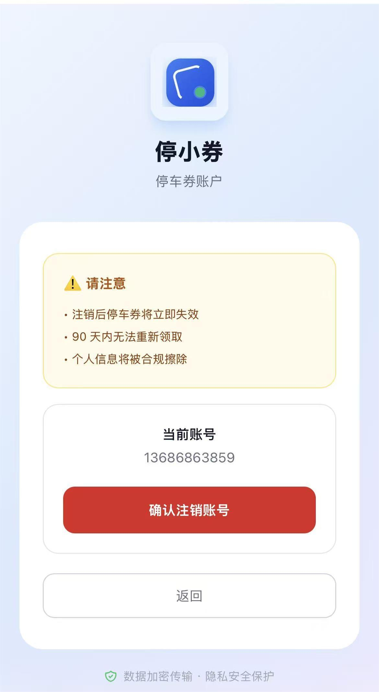 |

| 风控拦截 (手机号注销库) | 风控拦截 (设备黑名单) | 风控拦截 (设备注册超限) |
|:---:|:---:|:---:|
|  | 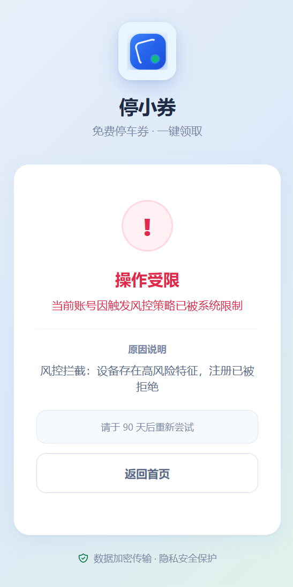 | 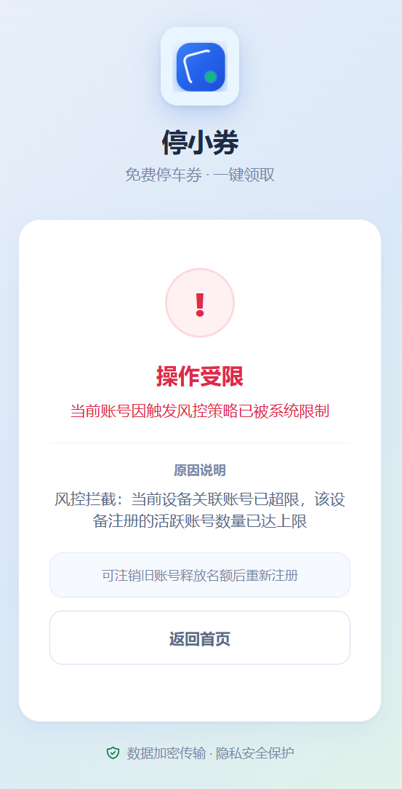 |

### B 端（管理后台）

**安全登录** — Argon2id 密码校验 + RS256 JWT

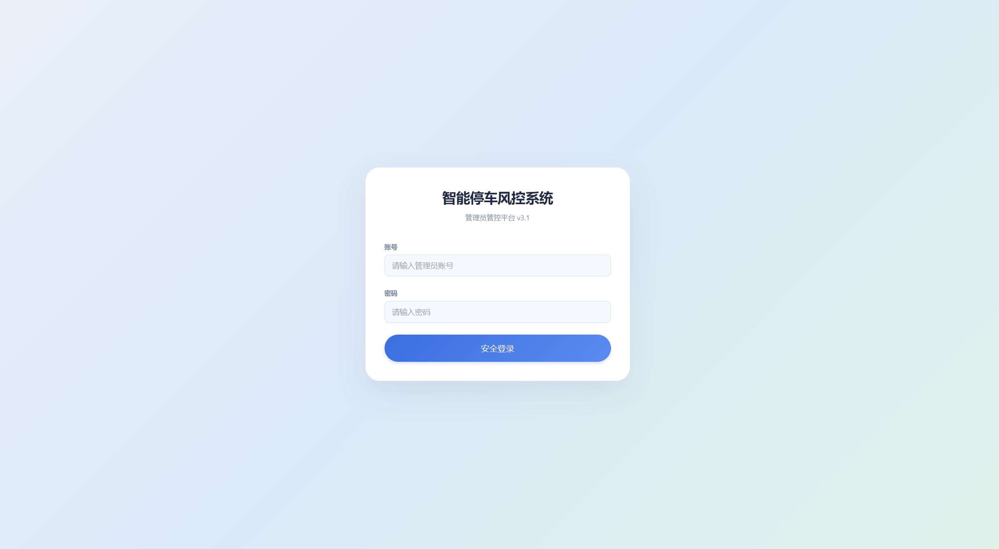

**风控监控大盘** — 实时拦截趋势、用户统计、黑名单数

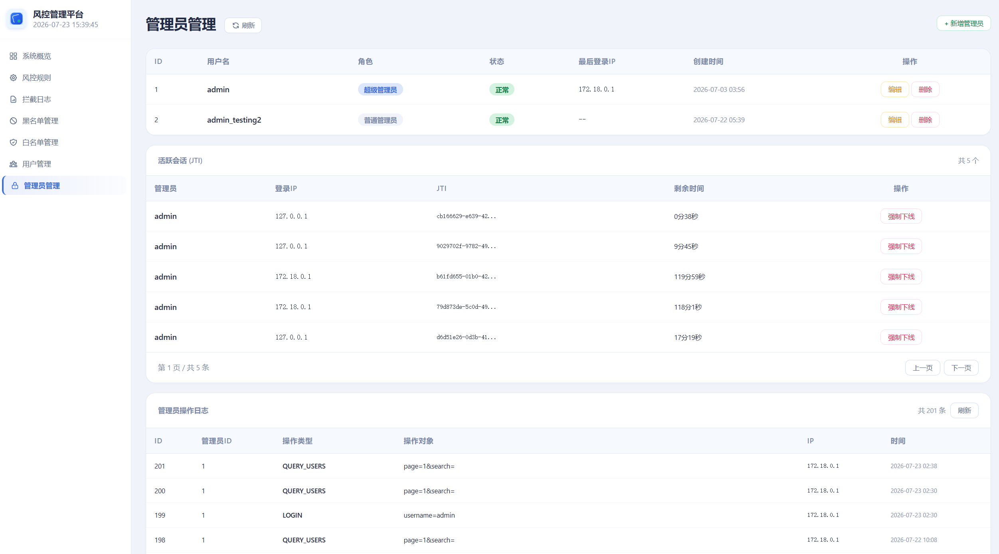

**风控规则配置** — 在线调整限流阈值、黑名单天数（修改即时生效，无需重启）

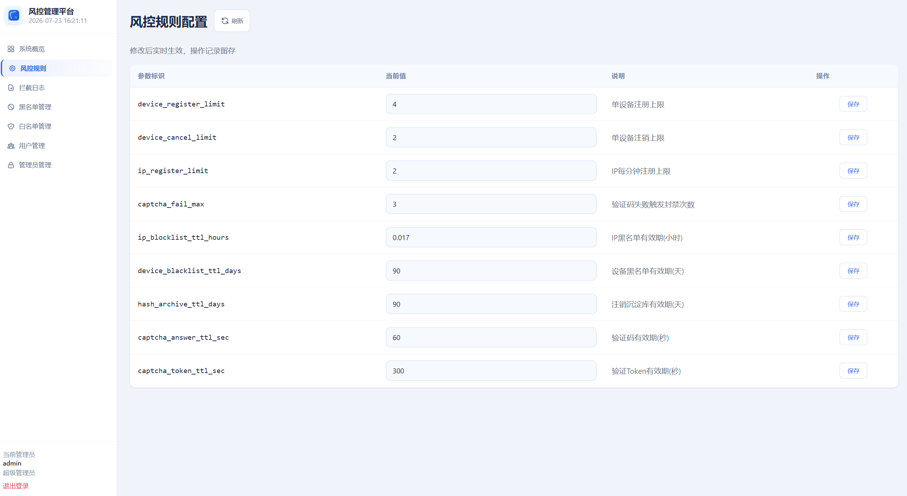

**黑名单管理** — 支持手机号搜索、手动添加、解封

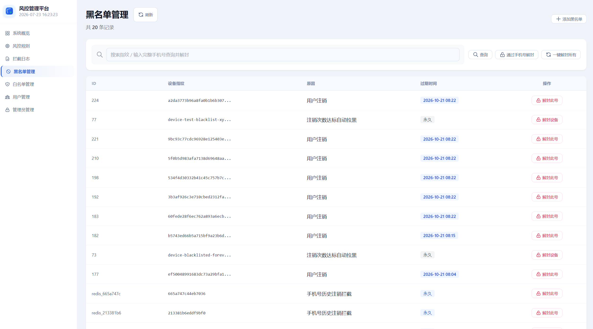

**拦截日志** — 每条拦截的 IP、设备哈希、原因、风险等级

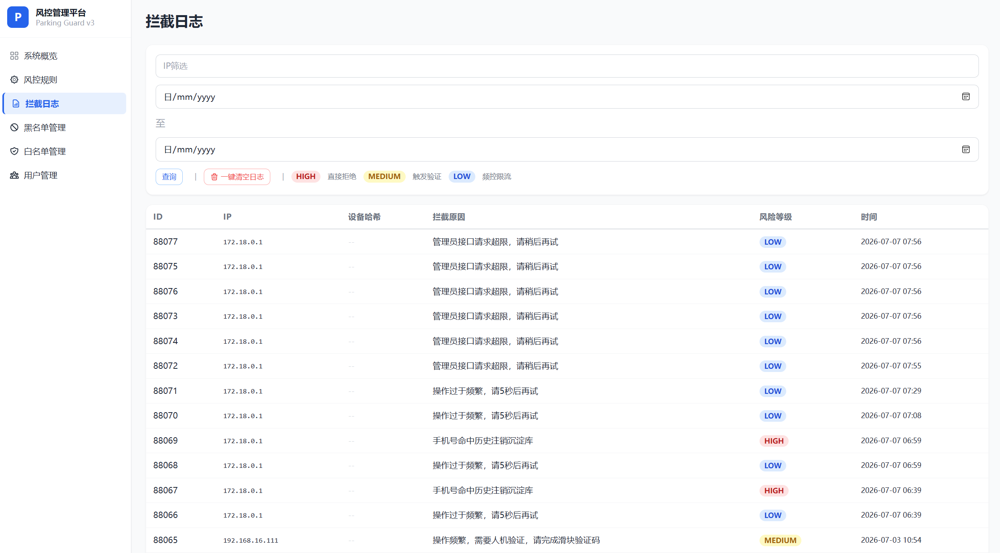

**白名单管理** — 免检 VIP 通道


**用户管理** — 透明蓝框显示/隐藏手机号，踢出功能

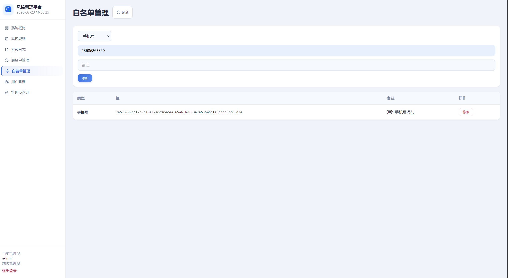

### 基础设施

**Docker 容器** — 三个服务（backend / redis / mysql）全部运行中

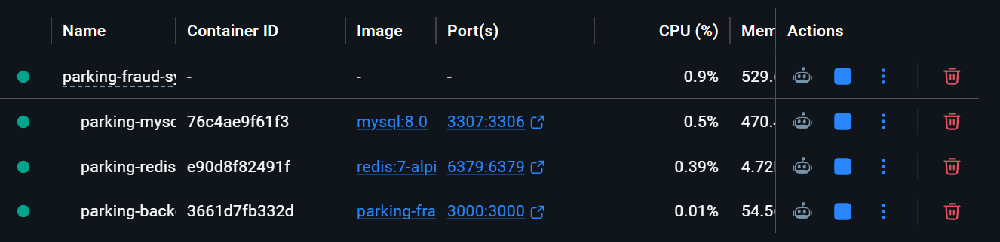

**Redis 黑名单 Key** — 缓存中的风控黑名单

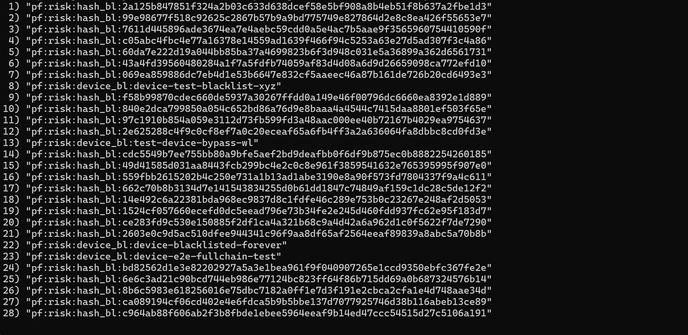

**MySQL 用户表（密文）** — `phone` 列为 AES-256-CBC 密文，非明文

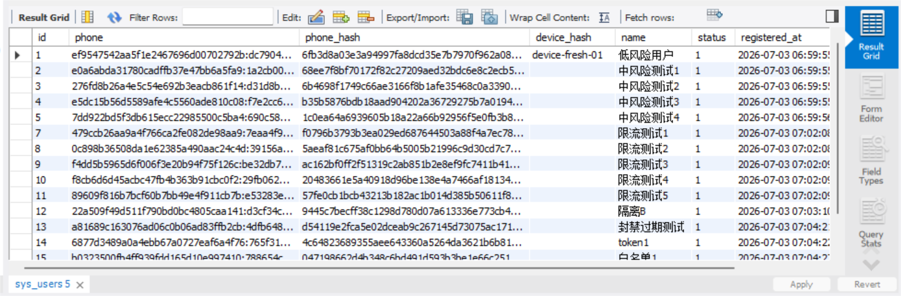

**MySQL 拦截日志** — 拦截原因、风险等级、时间戳

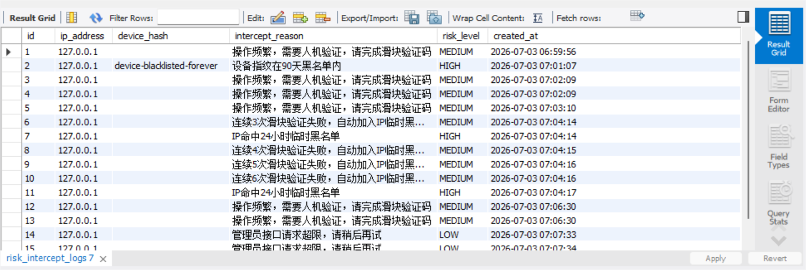

---

## 数据安全

### 手机号：双层存储

停车用户注册时，手机号产生两份数据，各司其职：

```
13812345678
   |
   +--> sys_users.phone (AES-256-CBC，目前金融和政府系统广泛使用的加密标准)
   |    格式: iv:cipher
   |    可逆: 是，需 ENCRYPT_KEY 解密
   |    用途: 管理员后台查看用户详情
   |
   +--> sys_users.phone_hash (SHA256 加盐哈希)
        格式: 64 位 hex
        可逆: 否，单向不可逆
        用途: 注册时查重、注销后黑名单匹配
```

**为什么两份？各自解决什么问题？**

**AES 加密（可逆）**：手机号是敏感个人信息，如果数据库被拖走，明文直接泄露。用 AES-256-CBC 加密后，存储的是 `iv:cipher` 乱码，只有持有 `.env` 中 `ENCRYPT_KEY` 的服务端才能解密还原。**用途**：管理员需要查看用户详情时，通过审计接口解密后展示。

**SHA256 哈希（不可逆）**：注销后的手机号被加入黑名单 `pf:risk:hash_bl:{phoneHash}`，下次注册时系统只需判断「这个号在不在黑名单里」。SHA256 哈希比对亚毫秒完成，比逐条 AES 解密快几个数量级，且全程不触碰解密密钥。**用途**：注册时的手机号查重、注销后的黑名单匹配、批量高频拦截。

**两者区别**：

| | AES 加密 | SHA256 哈希 |
|:---|:---|:---|
| 能否还原 | 能，需密钥 | 不能，单向 |
| 速度 | 较慢（CPU 密集） | 极快 |
| 用途 | 管理员按需查看 | 黑名单查重、批量拦截 |
| 相当于 | 带锁的保险箱 | 按手印（能比对身份但无法还原长相） |

### 管理员后台：手机号展示与审计

管理员打开用户管理页面，所有手机号默认脱敏（`138****5678`）。只有点击「显示」按钮或「显示全部明文」时，后端才调用 AES 解密接口返回明文，操作同步写入 `sys_audit_logs`。明文显示后可一键切回脱敏。整个流程确保明文不会默认暴露在任何页面或日志中。

### 管理员密码：Argon2id（慢速哈希）

管理后台的登录密码用 Argon2id 保存。这是一种故意设计得「又慢又吃内存」的哈希算法——每次计算消耗 16MB 内存，耗时 50-100ms。对正常管理员来说登录无感，但如果攻击者拿到数据库想用显卡暴力破解，每秒只能试十几次，而普通 SHA256 一秒能算几亿次。**用途**：即便数据库完全泄露，攻击者也几乎不可能从哈希值反推出原始密码。

> ⚡ 注销操作用 SHA-256 替代 Argon2id 生成归档指纹，避免单核服务器上阻塞 Node.js 事件循环导致后续请求排队。一线拦截仍靠 `phone_blacklist_map`（SHA256 hash 匹配），安全性无影响。

### 登录凭证：RS256 JWT

管理员登录后，后端签发一张 RS256 JWT 作为身份凭证，存入 HttpOnly Cookie。后台所有操作（查看黑名单、调整规则、解密手机号）都需校验此凭证，形成从签发、存储、校验到吊销的完整安全闭环。

**通俗类比**：JWT 像一张电子门禁卡，RS256 是非对称防伪章技术——私钥盖章、公钥验章。

---

#### 为什么用 RS256（非对称签名）

RS256（RSA-SHA256）包含一对密钥，职责分离：

| 密钥 | 持有方 | 用途 | 泄露后果 |
|:---|:---|:---|:---|
| 私钥 | 仅后端服务器 | 签发 JWT（盖章） | 严重，攻击者可伪造任意 token |
| 公钥 | 可任意分发 | 校验 JWT（验章） | 无影响，没有私钥无法伪造签名 |

对比常见的 **HS256（对称签名）**，只有一把密钥既盖章又验章——如果 `.env` 配置文件泄露，攻击者拿到密钥就能直接签发合法 token，冒充任意管理员。

RS256 的「私钥盖章、公钥验章」模型从根本上降低了配置泄露的风险：只要私钥不泄，即使公钥和 `.env` 全部暴露，攻击者也永远造不出能通过校验的签名。

---

#### 为什么强制 `algorithms: ['RS256']`

这是堵上 JWT 的一个经典安全漏洞——**算法降级攻击**：

JWT 头部有一个 `alg` 字段声明签名算法。如果后端不做强制校验，攻击者可以把 `alg` 改为 `none`（意为「不需要签名」），后端若盲目信任这个字段就会接受一张没有防伪章的假凭证。

显式写死 `algorithms: ['RS256']` 意味着：
- 无论 token 头部声明的 `alg` 是什么，后端**强制用 RS256** 算法验签
- `alg: none`、`alg: HS256` 等伪造 token 一律拒绝
- 直接堵死算法降级攻击的所有变体

---

#### Cookie 三道加固

| 加固项 | 含义 | 防御什么 | 为什么需要 |
|:---|:---|:---|:---|
| `httpOnly: true` | 禁止 JS 读取 Cookie | XSS 窃取凭证 | 即使页面被注入恶意脚本，攻击者也偷不到 JWT |
| `sameSite: 'strict'` | 仅同站请求携带 Cookie | CSRF 跨站冒用 | 恶意网站无法借用你的登录身份向后台发请求 |
| Redis JTI 黑名单 | 每个 token 唯一编号可吊销 | 无法即时踢出下线 | 弥补原生 JWT「签发后过期前一直有效」的缺陷 |

**详细解读**：

**HttpOnly → 防 XSS 窃取**：普通 Cookie 可被页面中的 JavaScript 读取。如果网站存在 XSS 漏洞（攻击者注入恶意脚本），脚本就能直接偷走 Cookie 里的 JWT，获得管理员权限。加 `httpOnly` 后浏览器禁止任何 JS 访问该 Cookie，凭证与脚本完全隔离。

**sameSite: strict → 防 CSRF 冒用**：CSRF 攻击场景——你登录管理后台后点开一个恶意网站，该网站偷偷向后端发请求（如删黑名单），浏览器自动带上 Cookie，后端误以为是你本人的操作。`sameSite: strict` 规定只有后台自己域名发出的请求才携带此 Cookie，第三方请求一律不带，彻底切断跨站冒用。

**JTI 黑名单 → 支持主动踢出**：每个 JWT 签发时带一个唯一 ID（JTI）。当需要强制某人下线（如账号泄露、管理员离职），把对应 JTI 写入 Redis 黑名单。此后每次请求后端先查黑名单（Redis SET 查询复杂度为 O(1)，不影响请求性能），命中则直接拒绝——即使 token 签名合法、未过期也无效。这弥补了原生 JWT「签发后无法中途作废」的缺陷。

---

#### 安全闭环

| 维度 | 措施 | 防御 |
|:---|:---|:---|
| 凭证本身 | RS256 非对称签名 | 签名伪造 |
| 算法层面 | `algorithms: ['RS256']` | 算法降级绕过 |
| 存储层面 | `httpOnly` Cookie | XSS 窃取凭证 |
| 传输层面 | `sameSite: strict` | CSRF 跨站冒用 |
| 生命周期 | Redis JTI 黑名单（O(1)） | 无法即时吊销 |

---

## 技术选型

### Node.js + Express（后端）

本项目核心是一条多层风控中间件链，每次注册请求依次经过 IP 黑名单、注册频控（IP 维度，阈值可在后台动态调整）、单设备注册上限检查、全局防刷、手机号限流，任一命中即拦截。Express 的洋葱圈模型天然适合这种「层层过滤」的架构：

```javascript
router.post('/register',
  ipBlacklist,        // 第一层：IP 是否在黑名单中
  regIpLimiter,       // 第二层：60s 内同 IP 超 N 次触发验证码（N 动态读取）
  globalIpLimiter,    // 第三层：全局 10 次/秒兜底
  phoneLimiter,       // 第四层：单手机号 5 秒内仅允许 1 次
  userController.register  // → 进入 riskService.checkAndRegister
                          //     第五层：单设备注册上限检查
                          //     第六层：设备黑名单检查
                          //     第七层：手机号注销库检查
);
```

风控系统是 IO 密集型 -- 每次注册要读写 Redis（查黑名单、计数）和 MySQL（入库）。Node.js 的非阻塞 IO 在大量并发注册时不会因等待网络而阻塞后续请求，与 Go/Java 的多线程模型相比，在这种场景下代码量和心智负担更小。

### 双存储：MySQL + Redis

MySQL 和 Redis 在本系统中分工明确：

**MySQL 负责持久化**。11 张表全部围绕停车反欺诈业务：`sys_users` 存注册用户，`sys_blacklist` + `risk_hash_archives` + `phone_blacklist_map` 三层黑名单沉淀，`risk_intercept_logs` 记录每次拦截，`sys_audit_logs` 追踪管理员操作。注销时涉及 5 步操作，MySQL 的 `BEGIN/COMMIT` 事务保证要么全做要么全不做，避免「用户已删但黑名单没写」的半成品状态。参数化查询防范 SQL 注入，红队测试中 4 项 SQL 注入攻击全部被拦截。

**Redis 负责高速拦截**。承担两个核心角色：

- 限流计数：`pf:limit:reg_ip:{ip}` 是注册频控的计数器。`INCR` 命令单线程原子执行，避免并发竞态。第一个请求设 60 秒 TTL，窗口结束自动归零。
- 黑名单命中：设备黑名单 `pf:risk:device_bl:{deviceId}` 和手机号注销库 `pf:risk:hash_bl:{phoneHash}` 均为 90 天 TTL。注册时亚毫秒级命中直接返回 403，无需触碰 MySQL，实现「热数据走缓存、冷数据走库」的分层架构。

Redis 不可用时，限流自动切内存 Map，黑名单切内存 Set，验证码答案切内存缓存 -- 系统不会因缓存故障而拒绝服务。

### React Native + Expo（移动端）

C 端用户通过 App 完成注册、滑块验证、领券、注销的完整闭环。React Native 一套代码同时覆盖停车场用户的 iOS 和 Android 设备，Expo 屏蔽了 Xcode/Android Studio 的原生配置，开发聚焦在业务链路：注册表单校验、滑块拼图交互、风控拦截提示（40301/40300/40302 错误码对应的 UI 反馈）。

### Docker Compose（部署）

三个容器（backend / redis / mysql）通过 `docker-compose.yml` 编排。MySQL 配置了 `healthcheck`（每 10 秒 `mysqladmin ping`），backend 的 `depends_on` 等待 MySQL healthy 后才启动，避免后端启动时连不上数据库报错。

命名卷 `redis_data` 和 `mysql_data` 保证容器重启后拦截日志和黑名单数据不丢失。`/health/ready` 就绪探针用原生 TCP 直连检测 MySQL + Redis，3 秒超时，从宕机恢复时自动预热连接池。

---

## 自动化测试

测试报告自动生成于 `tests/reports/`。

### 红队渗透测试：26 用例，100% 通过，评级 A+

| 模块 | 攻击项 | 防线守住 | 评级 |
|:---|:---|:---|:---|
| 风控核心渗透 | 16 | 16 | A+ |
| 数据层安全（SQL 注入 / 密钥绕过） | 4 | 4 | A+ |
| 管理后台攻防（JWT 伪造 / 越权） | 6 | 6 | A+ |

- 恶意重刷压测：**13,696 次请求，1,369 QPS，平均延迟 6.8ms**
- JWT 伪造攻击：**2 次非法伪造全部拦截，0 次越权**
- 黑名单膨胀注入：**100 条，97 条被限流拦截（97%）**

### 蓝队功能验收：182 用例，100% 通过

| 模块 | 用例 | 通过 | 备注 |
|:---|:---|:---|:---|
| 风控核心（三级分级 / IP 封禁 / 滑块 / 白名单） | 69 | 69 | 耗时 241s |
| 数据层（表结构 / 读写一致 / 并发 / 事务 / 加密） | 8 | 8 | -- |
| 管理员后台（登录 / 限流 / 黑名单 CRUD / 概览） | 10 | 10 | -- |
| 工程化改造（统一格式 / JWT 鉴权 / 权限拦截） | 10 | 10 | -- |
| App 配置校验（app.json / eas.json / 资源 / 依赖） | 29 | 29 | -- |
| 健康探针（存活 / 就绪 / MySQL 降级 / Redis 降级） | 44 | 44 | 耗时 53s |
| 优雅关闭（SIGTERM / SIGKILL / 资源释放） | 12 | 12 | 耗时 25s |

### Jest 单元测试：32 用例，100% 通过

- `risk.service.test.js`：18 用例全部通过
- `encryption.test.js`：14 用例全部通过

```bash
cd tests && npm install && node index.js    # 一键运行全部测试
```

---

## 代码规范

项目配备 ESLint + Prettier 统一代码风格与格式：

```bash
# 代码检查
npx eslint backend/src/ mobile/src/

# 自动格式化
npx prettier --write backend/src/ mobile/src/
```

规则包括：禁止 `var`、强制 `===`、单引号、尾逗号、2 空格缩进、100 字符行宽等。

---

## 快速启动

### 1. 克隆并配置

```bash
git clone https://github.com/20060101zrd-gif/Smart_Parking_Anti_Fraud_System_V3.git
cd Smart_Parking_Anti_Fraud_System_V3
cp .env.example .env       # 编辑 .env 中的密码
```

### 2. 一键启动

```bash
docker-compose up -d --build

# 风控管理后台:  http://localhost:3000/index.html
# 用户管理页面:  http://localhost:3000/users.html
```

### 3. 一键解密手机号（命令行工具）

```bash
cd backend
node decrypt.js              # 脱敏模式（138****5678），截图安全
node decrypt.js --full       # 完整手机号
node decrypt.js --limit=10   # 只看最近 10 条
node decrypt.js --help       # 帮助
```

### 4. 运行测试

```bash
cd tests && npm install
node index.js
```

---

## API 接口清单

### C 端（用户）

| 方法 | 路径 | 说明 |
|:---|:---|:---|
| `POST` | `/api/v1/user/register` | 注册领券，经过四层中间件链 |
| `POST` | `/api/v1/user/verify-captcha` | 滑块验证 + 注册 |
| `POST` | `/api/v1/user/cancel` | 注销账号，触发 90 天黑名单 |
| `GET` | `/api/v1/captcha/generate` | 获取滑块验证码 |
| `POST` | `/api/v1/captcha/verify` | 提交滑块位置，答案一次性核销 |

### B 端（管理员）

| 方法 | 路径 | 说明 |
|:---|:---|:---|
| `POST` | `/api/v1/admin/login` | 登录，返回 JWT Cookie |
| `GET` | `/api/v1/admin/overview` | 风控大盘数据 |
| `GET` | `/api/v1/admin/intercept-logs` | 拦截日志，支持 IP/日期筛选 |
| `PUT` | `/api/v1/admin/config` | 动态调整风控规则 |
| `GET` | `/api/v1/admin/blacklist` | 黑名单，双源合并 + 手机号搜索 |
| `POST` | `/api/v1/admin/blacklist/add` | 手动添加黑名单 |
| `POST` | `/api/v1/admin/blacklist/remove` | 移除黑名单 |
| `POST` | `/api/v1/admin/blacklist/unban-phone` | 按手机号解封 |
| `GET` | `/api/v1/admin/whitelist` | 白名单列表 |
| `POST` | `/api/v1/admin/whitelist/add` | 添加白名单 |
| `POST` | `/api/v1/admin/whitelist/remove` | 移除白名单 |
| `GET` | `/api/v1/admin/users` | 用户列表，脱敏 + 分页 + 搜索 |
| `GET` | `/api/v1/admin/users/phone/:id` | 单用户手机号解密 |
| `POST` | `/api/v1/admin/users/decrypt-phones` | 批量解密，最多 100 条 |
| `GET` | `/api/v1/health` | 存活探针 |
| `GET` | `/api/v1/health/ready` | 就绪探针 |

> 解密接口均有审计日志记录。

---

## 项目结构

```text
parking-fraud-system/
+-- backend/
|   +-- src/
|   |   +-- controllers/    # 用户 & 管理员控制器
|   |   +-- services/       # 风控 / 审计 / 验证码 / 白名单
|   |   +-- middlewares/    # 限流 / JWT / 验证码Token / 黑名单
|   |   +-- data/           # Redis 客户端 / MySQL 连接池
|   |   +-- routes/         # API 路由 (v1)
|   |   +-- utils/          # 加密 / 日志 / 响应
|   +-- public/             # 管理后台（风控大盘 + 用户管理 SPA）
|   +-- sql/                # MySQL 初始化脚本
|   +-- decrypt.js          # 命令行工具：一键解密用户手机号
|   +-- Dockerfile
+-- mobile/
|   +-- src/
|   |   +-- screens/        # 注册 / 领券 / 注销
|   |   +-- components/     # 滑块验证码
|   +-- App.js
+-- tests/
|   +-- red-team/           # 6 个渗透攻击模块
|   +-- blue-team/          # 7 个功能验收模块
|   +-- unit/               # Jest 单元测试
|   +-- reports/            # 自动生成测试报告
|   +-- index.js            # 一键运行全部测试
+-- screenshots/
+-- docker-compose.yml
+-- redis.conf
+-- README.md
```

---

## CI/CD

**GitHub Actions** -- push/PR 触发全量自动化测试：`npm ci` --> Jest --> Docker Compose 启动 --> 红队 + 蓝队

**Codemagic** -- main 分支 push 触发 iOS unsigned IPA 构建

---

## 在线体验

> 系统已部署至阿里云服务器，扫码注册领取停车券

B 端（管理后台）：`http://parking-guard-v3.abrdns.com/index.html`
C 端（手机）：`http://parking-guard-v3.abrdns.com/app.html`


---

## 已知局限

- **分布式扩展**：当前单节点部署。多节点集群可基于已有 Redis 加 Redlock 分布式锁，解决跨节点计数器一致性。
- **风控维度**：当前以手机号哈希 + IP + 设备哈希为主，可扩展接入设备硬件物理指纹（传感器特征、屏幕参数等）。
- **日志监控**：当前拦截日志存 MySQL，可接入 ELK / Grafana 实现实时告警与可视化。

---

## 开源协议

MIT License -- 详见 [LICENSE](LICENSE)
